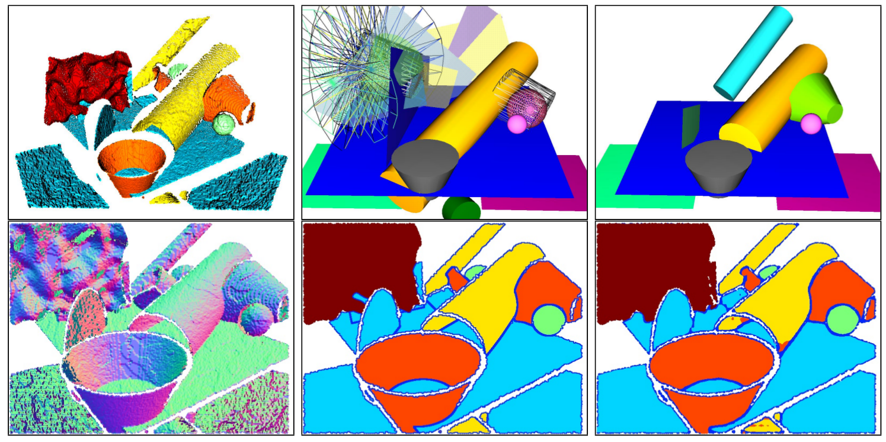
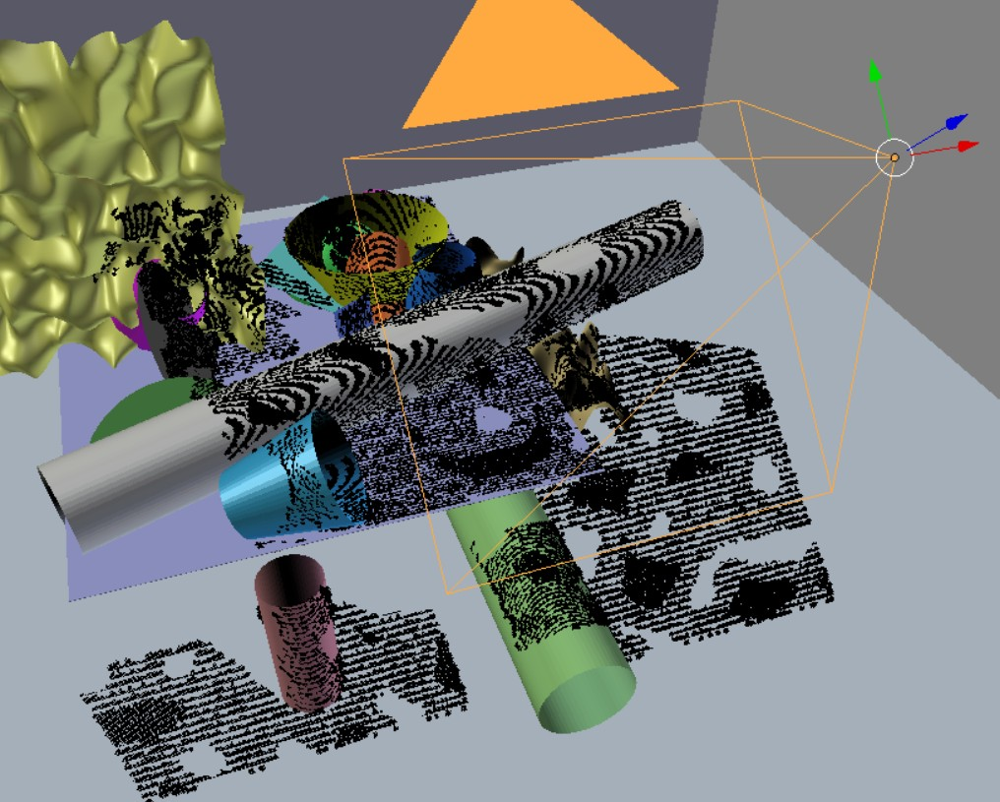

# Primitive Fitting Using Deep Boundary Aware Geometric Segmentation

By [Duanshun Li](https://duanshun.github.io/) and [Chen Feng](https://simbaforrest.github.io/).

## Introduction

To identify and fit geometric primitives (e.g., planes, spheres, cylinders, cones) in a noisy point cloud 
is a challenging yet beneficial task for fields such as robotics and reverse engineering. As a multi-model 
multi-instance fitting problem, it has been tackled with different approaches including RANSAC, which however 
often fit inferior models in practice with noisy inputs of cluttered scenes. Inspired by the corresponding human 
recognition process, and benefiting from the recent advancements in image semantic segmentation using deep neural
 networks, we propose BAGSFit as a new framework addressing this problem. 
 Firstly, through a fully convolutional neural network, the input point cloud is point-wisely 
 segmented into multiple classes divided by jointly detected instance boundaries without any geometric fitting. 
 Thus, segments can serve as primitive hypotheses with a probability estimation of associating primitive classes. 
 Finally, all hypotheses are sent through a geometric verification to correct any misclassification by 
 fitting primitives respectively. We performed training using simulated range images and tested it with both simulated 
 and real-world point clouds. Quantitative and qualitative experiments demonstrated the superiority of BAGSFit.

Primitive fitting on a simulated test range image (top left) with BAGSFit (top right) vs. RANSAC (top middle). 
Estimated normals (bottom left) and ground truth labels (bottom middle) are used to train a fully convolutional 
segmentation network in BAGSFit. During testing, a boundary-aware and thus instance-aware segmentation (bottom right) 
is predicted, and sent through a geometric verification to fit final primitives (randomly colored). Comparing with BAGSFit, 
the RANSAC-based method produces more misses and false detections of primitives (shown as transparent or wire-frame), 
and thus a less appealing visual result.

## Dataset

### Download

The dataset used in our [paper](https://arxiv.org/pdf/1810.01604.pdf) is provided
 on [Google Drive](https://drive.google.com/open?id=1JNjK5eQaVQn7w_gyvd2nszg_qCHSjqvl).

### Details
The dataset is created with [Blensor](http://www.blensor.org/) on simulated scenes.

 
 
In our paper, the first 18 scenes in Train-20s dataset is used for training, 
the last two scenes are used for valication. 
The Test-20s dataset is used for testing.

In each scene, there are several types of data:
+ The `.npz` files store the simulated data and their label;
+ The `primitives.prim` file stores the parameters of the objects in the scene;
+ The `cam.pos` file stores the pose of the camera for each image;
+ The `.prim` files record the parameters of the primitive in the camera's coordinate system.

Each `npz` file has following fields: 
+ `data`: the xyz coordinates of simulated data with noise;
+ `scan`: the xyz coordinates of simulated data without noise;
+ `ins`: the instance label
+ `cls`: the class label

The primitives are parameterized with following parameters:
+ `Plane`: a point on the plane and its norm; i.e. x, y, z, nx, ny, nz.
+ `Sphere`: a point on the center and its radius; i.e. x, y, z, r.
+ `Cylinder`: a point on the axis, the axis, and the radius; i.e. x, y, z, nx, ny, nz, r.
+ `Cone`: the apex, the axis, and the open angle in radius; i.e. x, y, z, nx, ny, nz, \\theta     

## Citation

You can reference the following [article](https://arxiv.org/pdf/1810.01604.pdf) if the dataset is used.

Li, Duanshun, and Chen Feng. "Primitive Fitting Using Deep Boundary Aware Geometric Segmentation." arXiv preprint arXiv:1810.01604 (2018).     
